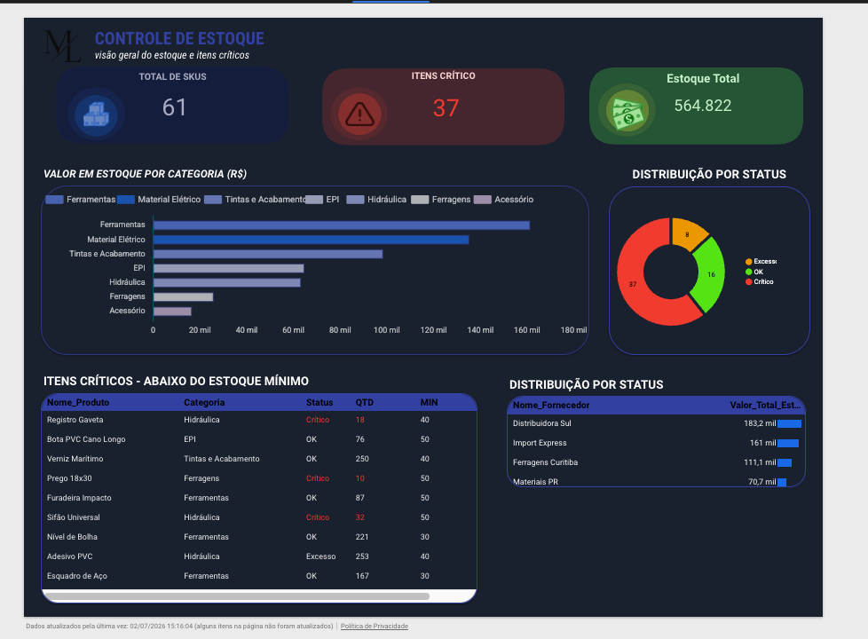
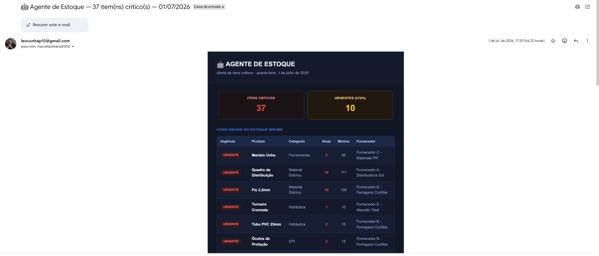

# 🤖 Controle de Estoque — Automação com Google Sheets + Apps Script

Sistema de monitoramento e alerta de estoque crítico, construído sobre Google Sheets, com automações em Apps Script e visualização em Looker Studio.

O problema que resolve é simples e comum em qualquer operação com estoque físico: **itens chegam ao nível crítico e ninguém percebe a tempo**, atrasando a reposição e travando a operação. Este projeto automatiza essa verificação e avisa a equipe em segundos, não em dias.

---

## 📸 Resultado

**Dashboard (Looker Studio)** — visão geral de SKUs, valor em estoque por categoria e distribuição por status:

**Alerta automático por e-mail** — disparado assim que a lista de itens críticos muda:

---

## ⚙️ Como funciona

O script roda em duas frentes, garantindo que nenhuma mudança passe despercebida:

- **Tempo real**: a cada edição na aba `Estoque`, o script aguarda 15 segundos (debounce) e então verifica se a lista de itens críticos mudou.
- **Verificação diária**: roda 1x por dia às 8h como camada de segurança, cobrindo edições feitas via API ou importação que não disparam o gatilho `onEdit`.

### Lógica de envio

- Aguarda o fim de uma sessão de edição antes de verificar (debounce), evitando múltiplos disparos enquanto a planilha ainda está sendo editada.
- Usa um **fingerprint** (assinatura) da lista de itens críticos: só envia um novo alerta se essa lista realmente mudou.
- Não reenvia o mesmo alerta se nada mudou.
- Se um novo produto entra em estado crítico, o e-mail sai imediatamente.
- Se todos os itens saem do crítico, o estado é resetado — a próxima entrada em crítico dispara um novo alerta normalmente.

### Resumo executivo com IA (opcional)

Se configurada uma API Key da Anthropic, o script gera automaticamente um resumo executivo curto destacando os itens mais urgentes e sugerindo a ação de reposição prioritária, incluído no topo do e-mail.

---

## 🧱 Stack

- **Google Sheets** — armazenamento e fonte de dados
- **Google Apps Script** — toda a lógica de automação (gatilhos, debounce, verificação, montagem e envio do e-mail)
- **Looker Studio** — dashboard de visão geral
- **Gmail (MailApp)** — envio de e-mail em HTML, nativo do Google, sem custo ou serviço externo
- **API Anthropic (Claude)** — geração opcional de resumo executivo

---

## 🚀 Como instalar

1. Na sua planilha do Google Sheets, vá em **Extensões > Apps Script**.
2. Cole o conteúdo de [`Agente_Estoque.gs`](./Agente_Estoque.gs).
3. Substitua a constante `DESTINATARIOS` pelos e-mails que devem receber o alerta.
4. *(Opcional, para o resumo com IA)* Em **Configurações do projeto > Propriedades do script**, adicione uma propriedade `ANTHROPIC_API_KEY` com sua chave da API Anthropic.
5. Rode a função `instalarGatilhos` **uma única vez**, manualmente. Isso configura os dois gatilhos (tempo real + diário) e solicita as permissões necessárias.

A planilha precisa ter uma aba chamada `Estoque` com, no mínimo, as colunas: `Nome_Produto`, `Categoria`, `Quantidade_Atual`, `Estoque_Minimo`, `Status`, `Fornecedor`.

---

## 👥 Autoria

Projeto desenvolvido em parceria por **Leo Cunha** e **Marcella Oliveira**, com apoio do ChatGPT e do Claude ao longo do desenvolvimento.
